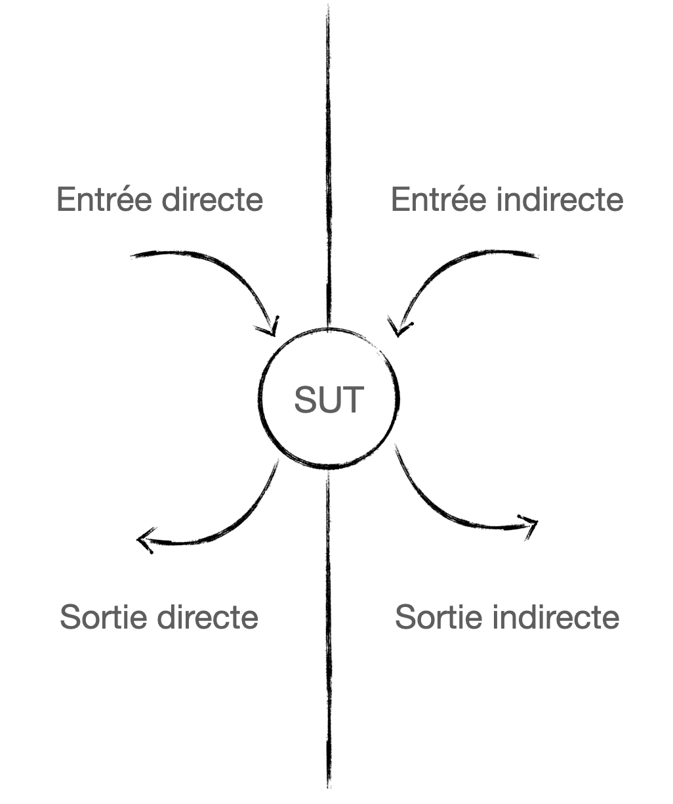

<!--
theme:  your-theme
size: linkedin-portrait
paginate: true
header: Choisir la bonne doublure de test
_header: ''
_footer: Charles Desneuf
footer: Charles Desneuf
-->

# Choisir la bonne doublure de test

Le choix de la doublure dépend de ce que vous souhaitez contrôler ou vérifier.

---

## Entrées, Sorties, Directes, Indirectes

Créons un petit modèle mental d'un système sous test et de ses entrées sorties.

<div class="container middle">
    
</div>

<span class="small">
<ul>
<li>Entrée directe : paramètres passés à une fonction / appel de fonction seul</li>
<li>Entrée indirecte : données fournies par une dépendance</li>
<li>Sortie directe : valeur retournée par une fonction</li>
<li>Sortie indirecte : appels effectués sur une dépendance</li>
</ul>
</span>


---

## Dans du code, ça donne...

```php
class Serveur {
    public function peutAccepterPaiement(): bool { // ⬅️ sortie directe
        // entrée indirecte ⬇️    
        return $this->caisse->estConnectéeALaBanque();
    }

    public function encaisse($commande) {
        // sortie indirecte ⬇️
        $this->caisse->acceptePaiement($commande->id(), $commande->total());
    }
}
```

---

## Contrôler les entrées indirectes avec un Stub

- Utilisez un Stub quand vous voulez contrôler les données fournies par une dépendance
- On fait une _query_ à une dépendance
- Parfait pour simuler différents états du système

```php
class CaisseEnregistreuseStub implements CaisseEnregistreuse {
    public function __construct(private bool $connectée) {}

    // Contrôle l'entrée indirecte
    public function estConnecteeALaBanque(): bool {
        return $this->connectée;
    }
}

// Un serveur ne peut accepter le paiement si la caisse n'est pas connectée à la banque
$caisse = new CaisseEnregistreuseStub(false);
$serveur = new Serveur($caisse);
Assert::assertFalse($serveur->peutAccepterPaiement());
```

---

## Vérifier les sorties indirectes avec un Spy

- Le Spy observe ce qui est fait par le système testé
- Permet de vérifier que les bonnes actions ont été effectuées
- Vérifier une commande passée

```php
class CaisseEnregistreuseSpy implements CaisseEnregistreuse {
    public array $paiements = [];

    public function acceptePaiement($commandeId, $montant): void {
        $this->paiements[] = [$commandeId, $montant];
    }
}

// Un paiement est accepté quand le serveur encaisse une table
$caisse = new CaisseEnregistreuseStub(false);
$serveur = new Serveur($caisse);

$serveur->encaisseTable(19);

Assert::equals($paiementsAttendus, $caisse->paiements);
```

---
<!--
_footer: Charles Desneuf
_paginate: skip
-->

## Hop, une petite pause avant la suite !

Si tu rencontres des problèmes de maintenance avec tes tests, s'ils ne sont pas assez lisibles, s'ils cassent pour de mauvaises raisons, je peux t'aider.
<div class="offer">
    <div class="offer-content">
    Télécharge mon guide gratuit pour améliorer la lisibilité des tests.<br /><br />Le lien est en commentaire 👇
    </div>
    <div class="offer-img">
    <a href="https://formation.charlesdesneuf.com/guide-gratuit-5-idees-pour-ameliorer-la-lisibilite-de-vos-tests-automatises?utm_medium=social&utm_source=linkedin&utm_campaign=carousel-Stubbing%20du%20temps%20%3A%20Prendre%20le%20contr%C3%B4le%20du%20syst%C3%A8me">
    </a>
    </div>
</div>

---

## Alternative : le Mock pour les sorties indirectes

- Comme le Spy mais vérifie automatiquement
- Plus strict : échoue si utilisé différemment de ce qui était attendu

```php
class CaisseEnregistreuseMock implements CaisseEnregistreuse {
    public function __construct(
        private int $commandeIdAttendu,
        private float $montantAttendu
    ) {}

    public function acceptePaiement($commandeId, $montant): void {
        Assert::assertEquals($this->commandeIdAttendu, $commandeId);
        Assert::assertEquals($this->montantAttendu, $montant);
    }
}
```


---

## Le mock pour les entrées indirectes ?

Un mock peut aussi servir à controller les entrées indirectes. C'est, selon moi, un anti-pattern.

Cela arrive lorsque l'on veut maitriser à la fois les entrées indirectes et les sorties indirectes avec un collaborateur.

Dans ces cas-là, il faut revoir les frontières du système sous test / le design (pourquoi veut-on en savoir autant sur son fonctionnement ?) ou utiliser un fake pour remplacer la dépendance, ce qui réduit la connaissance du lien entre les deux.

---

## Quand utiliser un Fake ?

- Pour remplacer des composants complexes
- Quand on a pas besoin de contrôle fin sur les appels
- Quand on s'intéresse au résultat obtenu plutôt qu'à la collaboration entre le SUT et le collaborateur.

---

## Quand utiliser un Dummy ?

- Dès que l'on a besoin de passer une dépendance qui n'a pas de rôle particulier pour le comportement testé.

<span class="small">Hum, est-ce que l'utilisation de dummies ne serait pas une indication à propos de notre design ? 🤔</span>